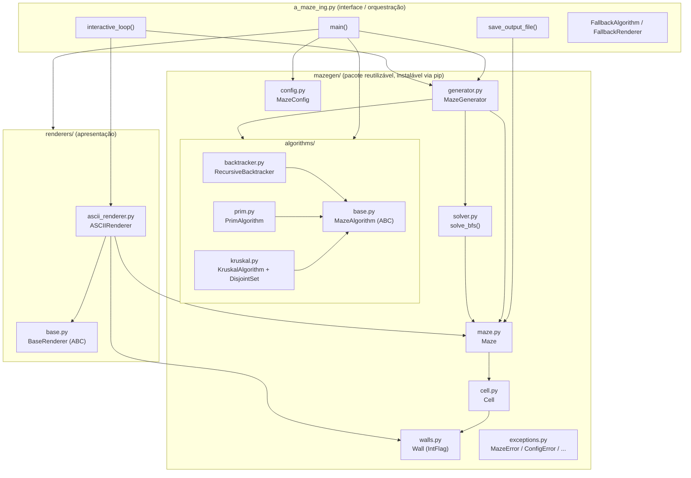
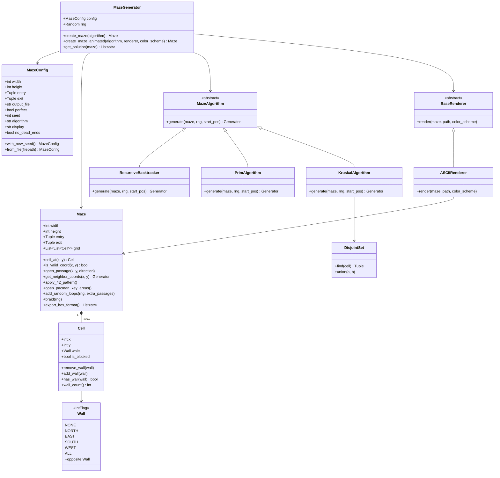
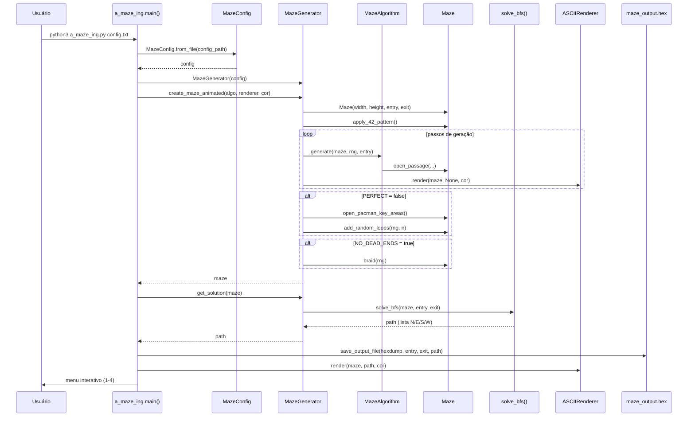
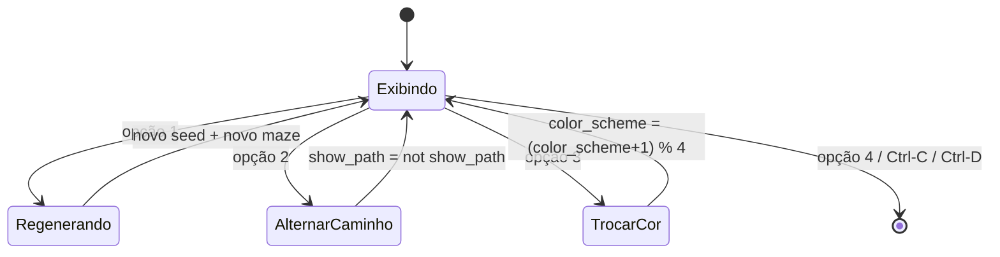

*This project has been created as part of the 42 curriculum by &lt;vde-alme&gt;[, &lt;rgoulart&gt;].*

# A-Maze-ing

## Sumário

- [Description](#description)
- [Arquitetura](#arquitetura)
  - [Visão geral dos módulos](#visão-geral-dos-módulos)
  - [Diagrama de pacotes](#diagrama-de-pacotes)
  - [Diagrama de classes](#diagrama-de-classes)
  - [Fluxo de execução (sequência)](#fluxo-de-execução-sequência)
  - [Máquina de estados do menu interativo](#máquina-de-estados-do-menu-interativo)
- [Instructions](#instructions)
  - [Requisitos](#requisitos)
  - [Instalação](#instalação)
  - [Execução](#execução)
  - [Debug](#debug)
  - [Lint / Type-check](#lint--type-check)
  - [Limpeza](#limpeza)
  - [Build do pacote `mazegen`](#build-do-pacote-mazegen)
- [Arquivo de configuração](#arquivo-de-configuração)
- [Formato do arquivo de saída](#formato-do-arquivo-de-saída)
- [Algoritmos de geração](#algoritmos-de-geração)
  - [Por que escolhemos estes algoritmos](#por-que-escolhemos-estes-algoritmos)
- [Reusabilidade do código (`mazegen`)](#reusabilidade-do-código-mazegen)
- [Referência de funções e classes](#referência-de-funções-e-classes)
  - [`a_maze_ing.py` (script principal)](#a_maze_ingpy-script-principal)
  - [`mazegen/config.py`](#mazegenconfigpy)
  - [`mazegen/walls.py`](#mazegenwallspy)
  - [`mazegen/cell.py`](#mazegencellpy)
  - [`mazegen/maze.py`](#mazegenmazepy)
  - [`mazegen/solver.py`](#mazegensolverpy)
  - [`mazegen/generator.py`](#mazegengeneratorpy)
  - [`mazegen/exceptions.py`](#mazegenexceptionspy)
  - [`mazegen/algorithms/`](#mazegenalgorithms)
  - [`renderers/`](#renderers)
- [Padrão "42"](#padrão-42)
- [Modo Perfeito vs. Modo Pac-Man](#modo-perfeito-vs-modo-pac-man)
- [Bônus implementados](#bônus-implementados)
- [Equipe e gestão do projeto](#equipe-e-gestão-do-projeto)
- [Resources](#resources)
- [License](#license)

---

## Description

**A-Maze-ing** é um gerador de labirintos escrito em Python 3.10+. A partir de um
arquivo de configuração texto (`config.txt`), o programa:

1. Gera um labirinto retangular, de forma reprodutível (via `seed`), usando um
   dos algoritmos clássicos de geração de labirintos (**Recursive Backtracker**,
   **Prim aleatorizado** ou **Kruskal aleatorizado**);
2. Aplica um padrão fixo em forma de **"42"** feito de células totalmente
   fechadas (bloqueadas), sempre visível na renderização;
3. Dependendo da flag `PERFECT`, produz um labirinto **perfeito** (uma única
   solução, sem loops — uma árvore geradora do grafo de células) ou um
   **tabuleiro estilo Pac-Man** (múltiplas rotas independentes, cantos e
   centro sempre acessíveis, poucos becos sem saída);
4. Calcula o **caminho mais curto** entre a entrada e a saída via busca em
   largura (BFS);
5. Grava o labirinto no arquivo de saída usando uma **codificação
   hexadecimal de paredes** (um dígito hexadecimal por célula);
6. Exibe o labirinto em um **renderer ASCII** no terminal, com cores e
   caminho de solução, e disponibiliza um **menu interativo** para
   regenerar o labirinto, mostrar/ocultar o caminho e trocar a paleta de
   cores.

O núcleo de geração de labirintos (o pacote `mazegen`) foi projetado como um
**módulo reutilizável e instalável via pip**, independente da interface de
usuário (`a_maze_ing.py`) e dos renderizadores (`renderers`), para que possa
ser importado em projetos futuros (por exemplo, um jogo Pac-Man completo).

---

## Arquitetura

### Visão geral dos módulos

O projeto é dividido em **três camadas independentes**, comunicando-se apenas
através de interfaces bem definidas (classes abstratas / ABCs):

| Camada | Pacote | Responsabilidade |
|---|---|---|
| Interface / Orquestração | `a_maze_ing.py` | Lê `config.txt`, escolhe algoritmo/renderer, roda o loop interativo, grava o arquivo de saída. |
| Geração de labirintos (reutilizável) | `mazegen/` | Estruturas de dados (`Cell`, `Maze`, `Wall`), configuração (`MazeConfig`), algoritmos de geração, solver BFS e orquestrador (`MazeGenerator`). Empacotável e instalável via `pip`. |
| Apresentação | `renderers/` | Renderização visual do labirinto (atualmente ASCII/ANSI no terminal). |

Essa separação permite, por exemplo, trocar o renderer ASCII por um renderer
gráfico (MLX) sem tocar em nenhuma linha do pacote `mazegen`, ou reutilizar
`mazegen` em outro projeto sem herdar nenhuma dependência de terminal.

### Diagrama de pacotes



### Diagrama de classes



### Fluxo de execução (sequência)



### Máquina de estados do menu interativo



---

## Instructions

### Requisitos

- Python **>= 3.10**
- `pip` (ou `uv`/`pipx`) para instalar dependências de desenvolvimento
- Terminal com suporte a códigos ANSI e tamanho mínimo compatível com o
  labirinto configurado (`largura*2+1` colunas × `altura+6` linhas)

### Instalação

```bash
make install
```

Isso atualiza o `pip`, instala `flake8`, `mypy`, `build` e `pytest`, e instala
o pacote `mazegen` em modo editável (`pip install -e .`) a partir do
`pyproject.toml`.

### Execução

```bash
make run
# equivalente a:
python3 a_maze_ing.py config.txt
```

O único argumento é o caminho para o arquivo de configuração (pode ter
qualquer nome, `config.txt` é apenas o padrão usado pelo `Makefile`).

### Debug

```bash
make debug
# equivalente a:
python3 -m pdb a_maze_ing.py config.txt
```

### Lint / Type-check

```bash
make lint
# flake8 .
# mypy --warn-unused-ignores --ignore-missing-imports \
#      --warn-return-any --disallow-untyped-defs \
#      --check-untyped-defs a_maze_ing.py mazegen renderers

make lint-strict
# flake8 .
# mypy --strict a_maze_ing.py mazegen renderers
```

### Limpeza

```bash
make clean
```

Remove `__pycache__`, `.mypy_cache`, `.pytest_cache`, `build/`, `dist/`,
`*.egg-info` e o arquivo de saída `maze_output.hex`.

### Build do pacote `mazegen`

```bash
make build-pkg
```

Cria um ambiente virtual isolado, instala a ferramenta `build` e gera o wheel
`mazegen-1.0.0-py3-none-any.whl` (ou `.tar.gz`) a partir de `pyproject.toml`,
copiando o artefato para a raiz do repositório.

---

## Arquivo de configuração

Formato: um par `CHAVE=VALOR` por linha; linhas começando com `#` são
comentários e são ignoradas.

| Chave | Obrigatória | Descrição | Exemplo |
|---|---|---|---|
| `WIDTH` | Sim | Largura do labirinto (número de células) | `WIDTH=40` |
| `HEIGHT` | Sim | Altura do labirinto (número de células) | `HEIGHT=30` |
| `ENTRY` | Sim | Coordenada de entrada `x,y` | `ENTRY=0,0` |
| `EXIT` | Sim | Coordenada de saída `x,y` | `EXIT=39,29` |
| `OUTPUT_FILE` | Sim | Caminho do arquivo de saída | `OUTPUT_FILE=maze_output.hex` |
| `PERFECT` | Sim | `true`/`false` — labirinto perfeito (sem loops) ou tabuleiro Pac-Man | `PERFECT=true` |
| `SEED` | Não* | Semente do gerador aleatório (reprodutibilidade) | `SEED=42` |
| `ALGORITHM` | Não* | `backtracker`, `prim` ou `kruskal` | `ALGORITHM=kruskal` |
| `DISPLAY` | Não* | Modo de exibição (atualmente `ascii`) | `DISPLAY=ascii` |
| `NO_DEAD_ENDS` | Não | `true`/`false` — força um tabuleiro totalmente trançado (bônus) | `NO_DEAD_ENDS=false` |

\* Chaves adicionais permitidas pelo enunciado (seed/algorithm/display),
tratadas como obrigatórias por `MazeConfig.from_file` na implementação atual
(um `KeyError` é convertido em erro de configuração amigável se ausentes).

Um arquivo de configuração padrão está disponível na raiz do repositório:
[`config.txt`](./config.txt).

---

## Formato do arquivo de saída

- Um dígito hexadecimal por célula, uma linha de texto por linha do labirinto.
- Cada bit do dígito representa uma parede fechada (`1`) ou aberta (`0`):

| Bit (LSB → MSB) | Direção |
|---|---|
| 0 | Norte |
| 1 | Leste |
| 2 | Sul |
| 3 | Oeste |

- Células bloqueadas (padrão "42") são representadas por `F` (todas as
  paredes fechadas).
- Após uma linha em branco, seguem três linhas: coordenadas de entrada,
  coordenadas de saída e o caminho mais curto (`N`, `E`, `S`, `W`).
- Todas as linhas terminam com `\n`.

Exemplo (trecho):

```
3AF9...
...

0,0
39,29
EESSWNN...
```

O arquivo `maze_analyzer.py` fornecido no enunciado pode ser usado para
validar a coerência das paredes e o modo (`PERFECT`/Pac-Man) do arquivo
gerado.

---

## Algoritmos de geração

Três algoritmos clássicos de geração de labirintos perfeitos (árvores
geradoras) estão implementados em `mazegen/algorithms/`, todos
compartilhando a mesma interface `MazeAlgorithm.generate()`:

| Algoritmo | Arquivo | Estratégia | Característica visual |
|---|---|---|---|
| Recursive Backtracker | `backtracker.py` | DFS com pilha e backtracking | Corredores longos e sinuosos, poucos becos ramificados |
| Prim aleatorizado | `prim.py` | Expansão de fronteira (frontier) escolhida aleatoriamente | Muitos becos curtos, aspecto mais "orgânico"/ramificado |
| Kruskal aleatorizado | `kruskal.py` | União de arestas aleatórias via *Disjoint Set* (Union-Find) | Distribuição mais uniforme de becos, sem viés direcional |

Após a geração da árvore base:

- Se `PERFECT=false`, `MazeGenerator` chama `Maze.open_pacman_key_areas()`
  (abre cantos e centro) e `Maze.add_random_loops()` (adiciona passagens
  extras, quebrando a propriedade de árvore e criando os loops exigidos
  pelo modo Pac-Man).
- Se `NO_DEAD_ENDS=true`, `Maze.braid()` remove iterativamente todos os
  becos sem saída (bônus "tabuleiro trançado").

### Por que escolhemos estes algoritmos

- **Recursive Backtracker**: simples de implementar e entender (pilha +
  DFS), gera labirintos com "textura" reconhecível (poucos becos, corredores
  longos), sendo um bom algoritmo de referência/didático.
- **Randomized Prim**: complementa o backtracker gerando uma distribuição de
  becos bem diferente (mais ramificada), útil para comparar visualmente
  algoritmos diferentes com o mesmo `seed`/tamanho.
- **Randomized Kruskal**: por depender de *Union-Find* sobre o conjunto de
  arestas (e não de uma caminhada sobre o grafo), produz labirintos com
  viés estrutural mínimo, o que o torna uma ótima base para o modo Pac-Man
  (mais fácil de garantir cobertura uniforme antes de abrir os loops).

Oferecer os três (ao invés de escolher só um) foi decisão do time para
suportar o **bônus de múltiplos algoritmos** e permitir comparação empírica
de resultados a partir do mesmo `config.txt` (apenas trocando `ALGORITHM=`).

---

## Reusabilidade do código (`mazegen`)

O pacote `mazegen` foi desenhado para ser **completamente independente** de
E/S de terminal, `argparse`/`sys.argv` ou qualquer renderer — ele só depende
da biblioteca padrão do Python.

Partes reutilizáveis:

- `mazegen.config.MazeConfig` — configuração tipada (dataclass), com
  `from_file()` e `with_new_seed()`.
- `mazegen.maze.Maze` e `mazegen.cell.Cell` / `mazegen.walls.Wall` —
  estrutura de dados do labirinto (grade de células com paredes via
  bitflags), independente de como o labirinto foi gerado.
- `mazegen.algorithms.*` — algoritmos de geração, todos implementando a
  interface `MazeAlgorithm`, registráveis dinamicamente via
  `mazegen.generator.register_algorithm()`.
- `mazegen.solver.solve_bfs()` — solução de caminho mínimo, utilizável sobre
  qualquer `Maze`.
- `mazegen.generator.MazeGenerator` — classe de fachada (facade) única que
  orquestra config + algoritmo + regras de pós-processamento (Pac-Man/braid)
  e devolve um `Maze` pronto, além da solução via `get_solution()`.

### Exemplo básico de uso em outro projeto

```python
from mazegen import MazeConfig, MazeGenerator
from mazegen.algorithms.kruskal import KruskalAlgorithm

config = MazeConfig(
    width=20, height=15,
    entry=(0, 0), exit=(19, 14),
    output_file="out.hex",
    perfect=True,
    seed=123,
    algorithm="kruskal",
    display="ascii",
    no_dead_ends=False,
)

generator = MazeGenerator(config)
maze = generator.create_maze(KruskalAlgorithm())

# Acessando a estrutura gerada
cell = maze.cell_at(0, 0)
print(cell.walls, cell.is_blocked)

# Acessando uma solução (BFS entrada -> saída)
path = generator.get_solution(maze)
print("".join(path))  # ex.: "EESSWN..."

# Exportando para o mesmo formato hexadecimal usado no arquivo de saída
for line in maze.export_hex_format():
    print(line)
```

### Parâmetros customizáveis

Todos os campos de `MazeConfig` podem ser passados diretamente ao
instanciar a dataclass (tamanho, entrada/saída, `seed`, algoritmo, modo
perfeito ou não, braid) — não é necessário passar por um arquivo de
configuração para reutilizar o gerador em outro projeto.

### Empacotamento

O pacote é declarado em [`pyproject.toml`](./pyproject.toml)
(`name = "mazegen-v"`, build via `setuptools`) e pode ser construído com
`make build-pkg`, gerando um `.whl` instalável via `pip install
mazegen-1.0.0-py3-none-any.whl`.

---

## Referência de funções e classes

### `a_maze_ing.py` (script principal)

| Função/Classe | Descrição |
|---|---|
| `clean_exit()` | Restaura o cursor do terminal (caso oculto durante a animação) e imprime mensagem de interrupção pelo usuário. |
| `validate_terminal_size(width, height)` | Verifica se o terminal atual tem colunas/linhas suficientes para exibir o labirinto (`largura*2+1` × `altura+6`); encerra o programa com erro claro caso contrário. |
| `FallbackAlgorithm.generate(maze, rng, start_pos)` | Algoritmo trivial usado somente se nenhum algoritmo real (`mazegen.algorithms.*`) puder ser importado: abre todas as passagens possíveis sequencialmente. |
| `FallbackRenderer.render(maze, path, color_scheme)` | Renderer trivial usado somente se `renderers.ascii_renderer` não puder ser importado: imprime o labirinto no formato hexadecimal bruto. |
| `save_output_file(filepath, maze, entry, exit_pos, path)` | Grava o labirinto (`export_hex_format`), entrada, saída e caminho de solução no arquivo de saída, conforme o formato exigido pelo enunciado. |
| `interactive_loop(config, renderer, algorithm)` | Loop principal pós-geração: gera e anima o primeiro labirinto, salva o arquivo, anima a exibição do caminho e trata o menu (regenerar / mostrar-ocultar caminho / trocar cor / sair). |
| `main()` | Ponto de entrada: valida argumentos de linha de comando, carrega `MazeConfig`, resolve algoritmo e renderer pelos registros `ALGORITHMS`/`RENDERERS`, inicia `interactive_loop`, e trata todas as exceções de domínio (`ConfigError`, `PathNotFoundError`, `MazeError`) de forma elegante, sem travar o programa. |

### `mazegen/config.py`

| Função/Classe | Descrição |
|---|---|
| `MazeConfig` (dataclass) | Estrutura tipada com todos os parâmetros de geração/renderização (`width`, `height`, `entry`, `exit`, `output_file`, `perfect`, `seed`, `algorithm`, `display`, `no_dead_ends`). |
| `MazeConfig.with_new_seed()` | Retorna uma nova instância de `MazeConfig` idêntica, exceto por um novo `seed` aleatório (usado ao regenerar pelo menu). |
| `MazeConfig.from_file(filepath)` | Faz o parsing do arquivo `CHAVE=VALOR` (ignorando comentários `#`), converte tipos (`int`, `bool`, tuplas de coordenadas) e retorna um `MazeConfig` pronto. |

### `mazegen/walls.py`

| Função/Classe | Descrição |
|---|---|
| `Wall` (`IntFlag`) | Enumeração de bits: `NONE=0`, `NORTH=1`, `EAST=2`, `SOUTH=4`, `WEST=8`, `ALL=15`, compatível diretamente com a codificação hexadecimal do arquivo de saída. |
| `Wall.opposite` | Propriedade que retorna a direção cardeal oposta (usada para remover a parede correspondente na célula vizinha, garantindo coerência entre células vizinhas). |

### `mazegen/cell.py`

| Função/Classe | Descrição |
|---|---|
| `Cell(x, y)` | Representa uma célula da grade: posição, paredes (`Wall`, inicialmente `ALL`) e flag `is_blocked` (padrão "42"). |
| `Cell.remove_wall(wall)` | Remove uma parede específica via operação bit a bit (`&= ~wall`). |
| `Cell.add_wall(wall)` | Adiciona uma parede específica via operação bit a bit (`\|= wall`). |
| `Cell.has_wall(wall)` | Verifica se uma parede específica está presente. |
| `Cell.wall_count()` | Conta quantas paredes a célula possui (usado para detectar becos sem saída: `wall_count() == 3`). |

### `mazegen/maze.py`

| Função/Classe | Descrição |
|---|---|
| `Maze(width, height, entry, exit)` | Inicializa a grade `height × width` de `Cell`s, todas com as 4 paredes fechadas. |
| `Maze.cell_at(x, y)` | Acessa a célula na coordenada `(x, y)`. |
| `Maze.is_valid_coord(x, y)` | Verifica se a coordenada está dentro dos limites do labirinto. |
| `Maze.open_passage(x, y, direction)` | Remove a parede em `direction` da célula `(x, y)` **e** a parede oposta correspondente na célula vizinha, garantindo a coerência exigida pelo enunciado (paredes compartilhadas sempre coerentes entre vizinhos). |
| `Maze.get_neighbor_coords(x, y)` | Gera pares `(direção, (nx, ny))` para todos os vizinhos válidos (dentro da grade) de `(x, y)`. |
| `Maze.apply_42_pattern()` | Marca como `is_blocked=True` as células que formam o padrão fixo "42" (uma matriz `10×5` centralizada na grade), preservando entrada e saída mesmo que caiam sobre o padrão. |
| `Maze.open_pacman_key_areas()` | Abre passagens nos 4 cantos e no centro do labirinto (exigência do modo Pac-Man: cantos = fantasmas/super-pac-gums, centro = spawn do jogador). |
| `Maze.add_random_loops(rng, extra_passages)` | Abre um número alvo de passagens extras aleatórias entre células não bloqueadas já conectadas, criando os loops exigidos no modo Pac-Man (labirinto deixa de ser uma árvore/perfeito). |
| `Maze.braid(rng)` | Remove iterativamente todos os becos sem saída (`wall_count() == 3`) abrindo uma parede aleatória adicional em cada um, até não sobrar nenhum — usado no bônus `NO_DEAD_ENDS`. |
| `Maze.export_hex_format()` | Converte cada linha do labirinto em uma string de dígitos hexadecimais (`F` para células bloqueadas), no formato exigido pelo arquivo de saída. |

### `mazegen/solver.py`

| Função/Classe | Descrição |
|---|---|
| `solve_bfs(maze, start, end)` | Executa uma busca em largura (BFS) a partir de `start`, reconstruindo (via dicionário de pais) o caminho mais curto até `end` como uma lista de caracteres `N`/`E`/`S`/`W`. Retorna lista vazia se não houver caminho. |

### `mazegen/generator.py`

| Função/Classe | Descrição |
|---|---|
| `register_algorithm(name, algo_cls)` | Registra dinamicamente uma nova classe de algoritmo no dicionário global `ALGORITHMS`, permitindo extensão sem modificar o núcleo. |
| `MazeGenerator(config)` | Classe de fachada: guarda a configuração e inicializa o `random.Random(seed)` para reprodutibilidade. |
| `MazeGenerator.create_maze(algorithm)` | Cria o `Maze`, aplica o padrão "42", executa o algoritmo de geração até o fim, aplica regras de pós-processamento (`open_pacman_key_areas`/`add_random_loops` se não-perfeito; `braid` se `no_dead_ends`) e retorna o `Maze` final. |
| `MazeGenerator.create_maze_animated(algorithm, renderer, color_scheme)` | Mesma lógica de `create_maze`, mas renderiza o labirinto a cada passo do generator do algoritmo (usando escapes ANSI para limpar a tela), produzindo a animação de geração em tempo real. |
| `MazeGenerator.get_solution(maze)` | Chama `solve_bfs` e levanta `PathNotFoundError` caso não exista caminho válido entre entrada e saída. |

### `mazegen/exceptions.py`

| Classe | Descrição |
|---|---|
| `MazeError` | Exceção base de todos os erros de domínio do projeto. |
| `ConfigError` | Erros de parsing/validação do arquivo de configuração. |
| `GenerationError` | Erros durante a geração do labirinto. |
| `PathNotFoundError` | Nenhum caminho válido encontrado entre entrada e saída. |

### `mazegen/algorithms/`

| Função/Classe | Descrição |
|---|---|
| `MazeAlgorithm.generate(maze, rng, start_pos)` (ABC) | Interface comum a todo algoritmo de geração: recebe o `Maze` a ser esculpido, o gerador aleatório com seed fixa e a posição inicial; deve ser um *generator* que produz o `Maze` a cada passo (para permitir animação). |
| `RecursiveBacktracker.generate(...)` | Implementa DFS com pilha: a cada passo, escolhe um vizinho não visitado e não bloqueado aleatório, abre a passagem e empilha; faz *backtrack* (pop da pilha) quando não há vizinhos disponíveis. |
| `PrimAlgorithm.generate(...)` | Mantém uma lista de "fronteira" (arestas candidatas); a cada passo escolhe uma aresta aleatória da fronteira, conecta se o destino ainda não foi visitado, e expande a fronteira com os novos vizinhos. |
| `KruskalAlgorithm.generate(...)` | Constrói a lista de todas as arestas possíveis (Leste/Sul) entre células não bloqueadas, embaralha, e usa uma estrutura `DisjointSet` (Union-Find) para conectar apenas arestas que unem componentes diferentes, evitando ciclos. |
| `DisjointSet.find(cell)` | Encontra a raiz do conjunto de uma célula, com compressão de caminho. |
| `DisjointSet.union(first, second)` | Une os conjuntos de duas células. |

### `renderers/`

| Função/Classe | Descrição |
|---|---|
| `BaseRenderer.render(maze, path, color_scheme)` (ABC) | Interface comum a todo renderer: recebe o `Maze`, um caminho de solução opcional e o índice da paleta de cores ativa. |
| `ASCIIRenderer.render(...)` | Desenha o labirinto em uma "tela" de caracteres (`canvas`) usando códigos ANSI: paredes (`|`/`_`), célula de entrada (`E`, verde), saída (`X`, vermelho), células bloqueadas do padrão "42" (bloco branco) e o caminho de solução (`*`), aplicando uma dentre 4 paletas de cores (`color_scheme % 4`). |

---

## Padrão "42"

`Maze.apply_42_pattern()` sobrepõe uma matriz fixa `10×5` de células
totalmente bloqueadas (`is_blocked=True`), centralizada na grade, desenhando
visualmente o texto **"42"**. Essas células:

- Nunca fazem parte da árvore geradora (são ignoradas por todos os
  algoritmos de geração e pelo BFS);
- São exibidas como um bloco sólido pelo `ASCIIRenderer` e como `F` no
  arquivo de saída;
- Nunca sobrescrevem a entrada ou a saída, mesmo que coincidam com a
  posição do padrão;
- Caso o labirinto seja pequeno demais (`width < 10` ou `height < 5`), o
  padrão é simplesmente omitido (comportamento aceito pelo enunciado).

---

## Modo Perfeito vs. Modo Pac-Man

| | `PERFECT=true` | `PERFECT=false` (padrão) |
|---|---|---|
| Estrutura | Árvore geradora pura (um único caminho entre quaisquer duas células) | Árvore + loops extras |
| Cantos/centro | Sem regra especial | Sempre acessíveis (`open_pacman_key_areas`) |
| Loops | Nenhum | Pelo menos 2 rotas independentes (`add_random_loops`) |
| Becos sem saída | Podem existir livremente | Raros/tolerados; zero se `NO_DEAD_ENDS=true` (bônus, via `braid`) |
| Uso típico | Labirinto "clássico" com solução única | Tabuleiro jogável estilo Pac-Man |

---

## Bônus implementados

- **Múltiplos algoritmos de geração**: `backtracker`, `prim` e `kruskal`,
  selecionáveis via `ALGORITHM=` no `config.txt`.
- **Animação da geração do labirinto**: `MazeGenerator.create_maze_animated`
  renderiza cada passo do algoritmo em tempo real no terminal.
- **Tabuleiro totalmente trançado (0 becos sem saída)**: flag
  `NO_DEAD_ENDS=true`, implementada por `Maze.braid()`, verificável com
  `maze_analyzer.py --max-dead-ends 0`.

---

## Equipe e gestão do projeto

> Preencher com os dados reais da equipe antes da entrega.

| Membro | Função (role) | Principais responsabilidades |
|---|---|---|
| `<vde-alme>` | _(ex.: monolito modular e core)_ | `a_maze_ing.py`, `/mazegen`, `/algorithms/base.py`, `renderers/base.py` |
| `<rgoulart>` | _(ex.: interface/renderização e algoritmos)_ | `/mazegen/algorithms/ascii`, `/renderers/prim, kruskal, backtracker` |

**Planejamento inicial:** _primeiro definimos a modelagem, arquitetura,e a entrega de modulos funcionais, onde focamos primeiro na entrega do core do projeto, mazegen, onde o mesmo funciona sem algum algoritmo ou renderização, após isso deixamos o a_maze_ing.py com todos os plugins para aceitar qualquer algoritmo ou renderizador; **Como evoluiu:** a primcipio iriamos contruir os renderizadores tanto o ascii quanto o mlx, porem decidimos focar no ascii e focar energia nas animações cores e desing, entregando um experiencia visual mais aprimorada mesmo sendo em ascii; **O que funcionou bem:** ainda sim se futuramente quisermos implementar o mlx e a biblioteca minilib o mazegen o aceita sem nenhum problema, esta pronto para escalabilidade._

**O que poderia ser melhorado:** _Tempo para polir melhor o projeto e entregar um renderizador grafico mais moderno, mesmo gostanto do aspecto retro._

**Ferramentas usadas:** Git, `flake8`, `mypy`, `pytest`, `build`
(empacotamento), além de assistentes de IA (ver seção [Resources](#resources)).

---

## Resources

**Referências clássicas:**

- Jamis Buck, *"Mazes for Programmers: Code Your Own Twisty Little
  Passages"* — referência clássica sobre algoritmos de geração de
  labirintos (Backtracker, Prim, Kruskal, Braiding).
- Documentação oficial do Python: [`enum.IntFlag`](https://docs.python.org/3/library/enum.html#enum.IntFlag),
  [`dataclasses`](https://docs.python.org/3/library/dataclasses.html),
  [`collections.deque`](https://docs.python.org/3/library/collections.html#collections.deque)
  (usado na BFS).
- Teoria dos grafos: labirintos perfeitos como árvores geradoras (*spanning
  trees*); algoritmo de Kruskal e estrutura *Union-Find* (Disjoint Set).
- Documentação do [`setuptools`](https://setuptools.pypa.io/) e do módulo
  [`build`](https://build.pypa.io/) para empacotamento Python (`pyproject.toml`).
- [`flake8`](https://flake8.pycqa.org/) e [`mypy`](https://mypy-lang.org/)
  para padronização de estilo e checagem estática de tipos.

**Uso de IA no projeto:**

Ferramentas de IA (assistente conversacional) foram utilizadas para:

- Revisar e sugerir docstrings no padrão Google (PEP 257) para funções e
  classes já implementadas pela equipe.
- Discutir e comparar, em alto nível, as características de cada algoritmo
  de geração de labirintos (Backtracker vs. Prim vs. Kruskal) antes de
  decidirmos qual(is) implementar.
- Auxiliar na redação e estruturação deste `README.md` (diagramas de
  arquitetura e tabelas de referência de funções), a partir do código já
  escrito e revisado pela equipe.
- Servir como apoio para entender mensagens de erro do `mypy`/`flake8`
  durante o desenvolvimento.

---

## License

Este projeto (incluindo o módulo reutilizável `mazegen`) é distribuído sob a
licença **LGPD** — ver [`LICENSE.md`](./LICENSE.md). A licença permite
explicitamente o uso, cópia, modificação e distribuição deste gerador de
labirintos por projetos futuros que venham a reutilizá-lo, dando credito aos criadores.
